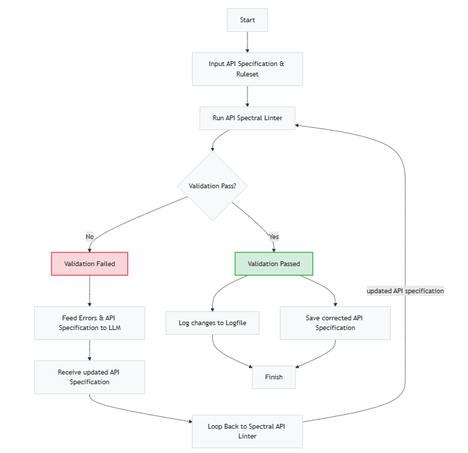

# self-governing-api-spec

API Governance plays a crucial role for organizations aiming to maintain consistency, quality, and security across their API portfolios. One key component of API governance is validating API specifications to ensure they adhere to design standards and best practices. By automating the validation and correction process, teams can reduce manual reviews and catch issues early.

This PoC leverages a large language models (LLMs) in combination with sophisticated tools like the Spectral linter to create a self-governing API specification. The system feeds an API specification and a custom ruleset into Spectral, checks for validation errors, and—if errors are found—automatically uses an LLM to correct the specification. The process iterates until the specification passes validation (up to n times). The final diff between the original and corrected specification is logged for review

## What It Does

- **Input:** Takes an OAS API specification and a corresponding ruleset 
- **Validation:** Uses Spectral to validate the API specification against the ruleset
- **Feedback Loop:** If the specification fails validation, error messages are sent to an LLM (via OpenRouter) which returns a corrected version
- **Logging:** Once the specification finally passes validation, a diff between the original and final specification is generated and saved as a changelog
- **Output:** The final, validated API specification is saved to a file

Below is a simplified flow diagram of the process:




## Setup & Usage

### Prerequisites

- Docker installed on your system.
- An API key for OpenRouter (free API Key usage for selected models) or any other LLM Provider

### How to Build and Run

1. **Clone the Repository:**

   ```bash
   git clone https://github.com/rbmhp/self-governing-api-spec.git
   cd self-governing-api-spec
   ```

2. **Add your LLM API Key:**
   
   Open the main.py file and replace the placeholder for OPENROUTER_API_KEY

3. **Build the Docker Image:**
   ```bash
   docker build -t self-governing-api-spec .
   ```
4. **Run the container:**

   Mount a host folder to save output files (like corrected_api_spec.yaml and changelog.txt)
   ```bash
   docker run --rm -v "path\to\your\project\self-governing-api-spec:/app" self-governing-api-spec
   ```
    
5. **Review the Output:**

   - The final validated API specification is saved to *corrected_api_spec.yaml*
   - The diff between the original and the final specification is logged in *changelog.txt*

## Demo
Below is an example of the output generated by API-Spec-SelfRefiner. It shows the final validated API specification along with the logged diff (changelog) between the original and the corrected API spec.


### Ruleset Checks

Our custom ruleset validates the following three aspects of your API specification:

1. **No "Fixme" Placeholder in Title:**  
   Ensures that the API title does not contain the word "fixme".

2. **Info Description Required:**  
   Ensures that the API's info section includes a non-empty description.

3. **Endpoint Kebab-Case:**  
   Ensures that all endpoint paths follow kebab-case (i.e. lowercase words separated by hyphens, starting with a '/').

###  Example API Specification (Non conformant OAS 3.0 specification against Ruleset)
```yaml
openapi: "3.0.0"
info:
  title: "fixme API"
  version: "1.0.0"
paths:
  /exampleEndpoint:
    get:
      summary: "Example endpoint"
      responses:
        '200':
          description: "Successful response"
````
### LLM Output: Corrected API Specification
```yaml
openapi: "3.0.0"
info:
  title: "Example API"
  version: "1.0.0"
  description: "API description"
paths:
  /example-endpoint:
    get:
      summary: "Example endpoint"
      responses:
        '200':
          description: "Successful response"
```

### Changelog
```diff
Final diff:
--- Original Spec
+++ Final Spec
@@ -1,11 +1,12 @@
 openapi: "3.0.0"
 info:
-  title: "fixme API"
+  title: "Example API"
   version: "1.0.0"
+  description: "API description"
 paths:
-  /exampleEndpoint:
+  /example-endpoint:
     get:
       summary: "Example endpoint"
       responses:
         '200':
           description: "Successful response"

